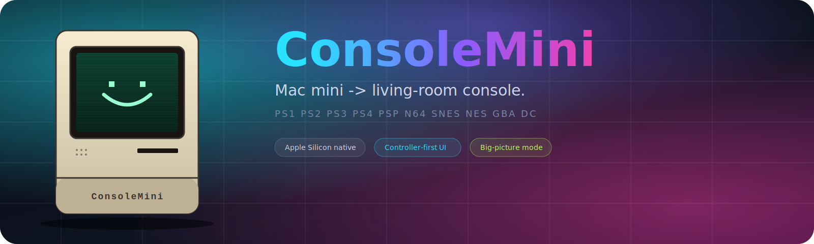
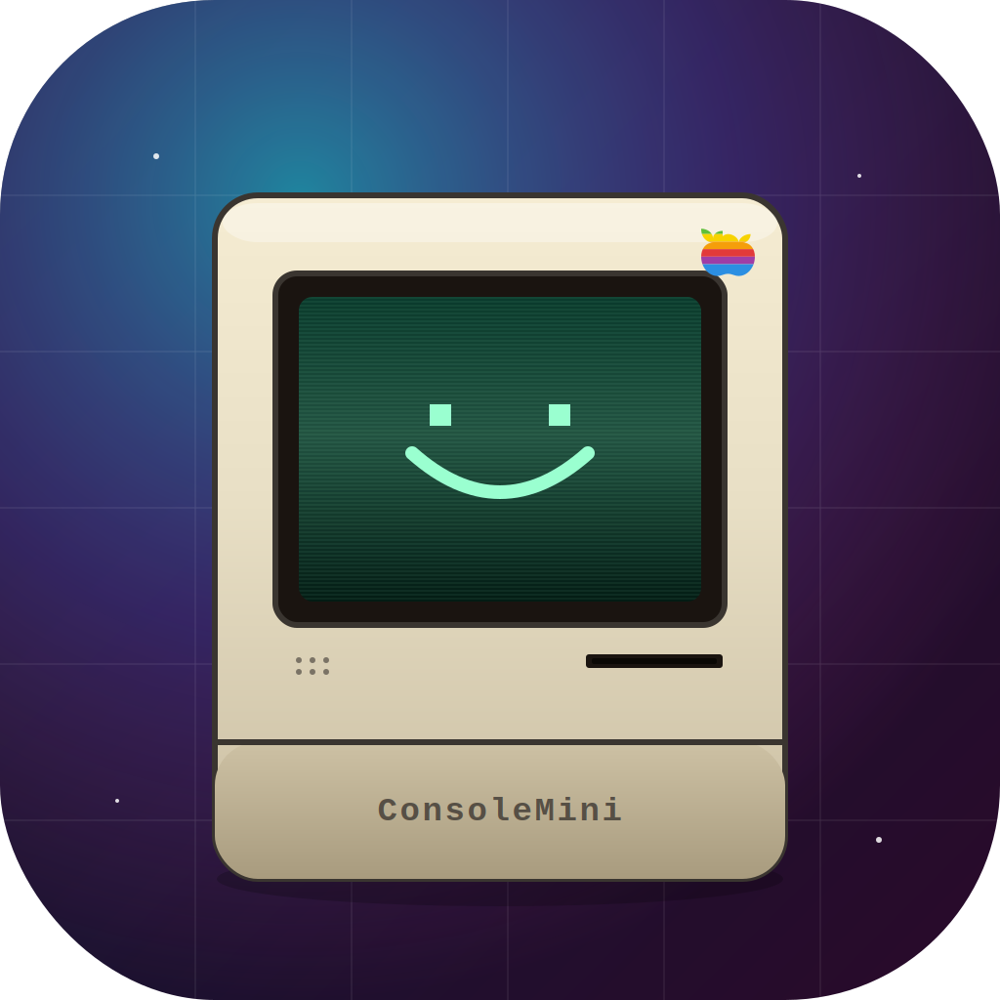

<p align="center">
  
</p>

<h1 align="center">
  <br/>
  ConsoleMini
</h1>

<p align="center"><b>Turn your Mac mini into a living-room retro / PlayStation console.</b><br/>
Plug a controller, pick a system, play. Beautiful big-picture launcher built with Electron + React + Tailwind + Framer Motion.</p>

<p align="center">
  
  
  
</p>

---

## What it is

ConsoleMini is a **launcher** that wraps your installed emulators in a controller-friendly UI. It does NOT bundle BIOS files or ROMs - bring your own (legally). Designed to live full-screen on a Mac mini hooked up to a TV.

### Supported systems

| Console | Emulator | Install | Notes |
|---|---|---|---|
| PS1 | DuckStation | `brew install --cask duckstation` | Stable, fast on M-series |
| PS2 | PCSX2 | `brew install --cask pcsx2` | Apple Silicon native |
| PS3 | RPCS3 | `brew install --cask rpcs3` | macOS build available - heavy |
| PS4 | shadPS4 | manual download | Experimental, low compat |
| PSP | PPSSPP | `brew install --cask ppsspp` | Native, runs at 4x easily |
| N64 | Mupen64Plus | `brew install mupen64plus` | CLI |
| SNES / NES | RetroArch + cores | `brew install --cask retroarch` | Pull cores from Online Updater |
| GBA | mGBA | `brew install --cask mgba` | |
| Dreamcast | Flycast | `brew install --cask flycast` | |

The Settings tab inside the app shows live install status and one-click installs everything via `scripts/install-emulators.sh`.

---

## Quick start

```bash
git clone https://github.com/<your-user>/ConsoleMini.git
cd ConsoleMini

# Install deps + emulators
bash scripts/setup.sh

# Run dev (Electron + Vite hot reload)
npm run dev:electron

# Build a distributable .app + .dmg
npm run package
```

Drop the built app into `/Applications`, then optionally run kiosk mode:

```bash
bash scripts/setup-kiosk.sh   # auto-launches at login, hides Dock, no sleep
```

---

## Controller support

- Any controller exposed through the **HTML5 Gamepad API** works (DualShock 4, DualSense, Xbox, 8BitDo, etc.) for **menu navigation**.
- For **in-game** input, the underlying emulator handles the controller directly. Pair the pad once via macOS Bluetooth and each emulator picks it up.
- Default mappings:

| Pad | Action |
|---|---|
| D-pad / Left stick | Navigate |
| A / Cross | Confirm |
| B / Circle | Back |
| Start | Open menu |
| Select | Toggle search |

Source: [`src/lib/gamepad.ts`](src/lib/gamepad.ts).

---

## ROM library

1. Open the app -> pick a system.
2. Click **Add ROM folder**, point at your collection.
3. ConsoleMini recursively scans for known extensions per console (no copy, no upload - paths only).

Recognised extensions live in [`src/lib/emulators.ts`](src/lib/emulators.ts) and [`electron/consoles.ts`](electron/consoles.ts). Override emulator binary paths via `config/consoles.json`.

---

## Project layout

```
ConsoleMini/
  electron/                # main process + preload (Node side)
    main.ts                # IPC handlers, window, emulator launch
    preload.ts             # contextBridge exposing window.bridge
    consoles.ts            # binary paths + arg builders
  src/
    App.tsx                # router, gamepad/keybind wiring
    components/            # Sidebar, Topbar, Hero, ConsoleCard, GameGrid, Settings
    lib/
      emulators.ts         # console catalogue (UI side)
      store.ts             # zustand state
      gamepad.ts           # HTML5 Gamepad polling -> action stream
      ipc.ts               # typed window.bridge wrapper
    styles/index.css       # Tailwind layers + glass tokens
  scripts/
    install-emulators.sh   # Homebrew install for all supported emulators
    setup.sh               # one-shot dev bootstrap
    setup-kiosk.sh         # auto-launch + sleep disable for living-room mode
  config/consoles.json     # runtime overrides for binary paths/args
```

---

## UI design

- Dark `#05060a` base with aurora gradients (`bg-aurora`) and overlaid grid (`grid-bg`).
- Glass surfaces via `backdrop-blur-xl` + 5-7% white fills.
- Per-console accent color (`accent` field) drives card glow + CTA highlight.
- Big tile sizing (3:4 covers, 56-72px hero buttons) tuned for couch viewing distance.
- Animations: Framer Motion for hover lift, layout transitions on grids, route fades.

---

## Roadmap

- [ ] Cover art scraper (LaunchBox / IGDB) with local cache
- [ ] Per-game hours played + last-played sort
- [ ] Cloud save sync (iCloud Drive folder mapper)
- [ ] In-app RetroArch core installer
- [ ] Themes (CRT scanline shader overlay, neon, minimal)
- [ ] Remote pairing via QR for phone-as-controller

---

## Legal

Emulators are installed from their official upstream sources. **You** must legally own any game you load. ConsoleMini ships zero ROMs and zero BIOS files. PlayStation, PS1-PS4, Nintendo, etc. are trademarks of their respective owners - this project is not affiliated.

MIT licensed. See [LICENSE](LICENSE).
