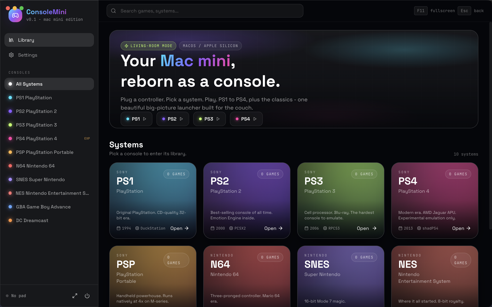
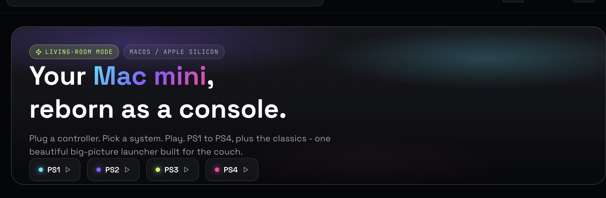
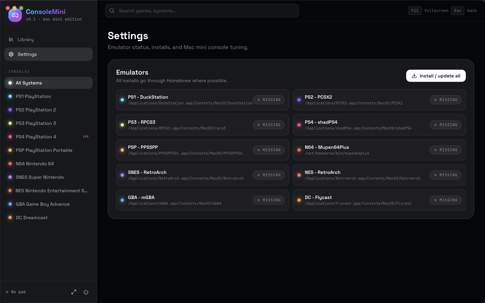

<p align="center">
  <a href="https://momenbasel.github.io/ConsoleMini/">
    
  </a>
</p>

<h1 align="center">
  <br/>
  ConsoleMini
</h1>

<p align="center">
  <b>Turn your Mac mini into a living-room PS1 - PS4 + retro console.</b><br/>
  Plug a controller, pick a system, play. Beautiful big-picture launcher built with Electron + React + Tailwind + Framer Motion.
</p>

<p align="center">
  <a href="https://github.com/momenbasel/ConsoleMini/releases/latest"></a>
  <a href="https://github.com/momenbasel/ConsoleMini/actions/workflows/build.yml"></a>
  
  
  <a href="https://github.com/momenbasel/ConsoleMini/stargazers"></a>
</p>

<p align="center">
  <a href="https://github.com/momenbasel/ConsoleMini/releases/latest"><b>Download DMG</b></a> ·
  <a href="https://momenbasel.github.io/ConsoleMini/"><b>Website</b></a> ·
  <a href="#install"><b>Install</b></a> ·
  <a href="#supported-systems"><b>Systems</b></a> ·
  <a href="#faq"><b>FAQ</b></a>
</p>

## Demo

<p align="center">
  <video src="https://github.com/momenbasel/ConsoleMini/raw/main/docs/demo.mp4" controls width="100%"></video>
</p>

<sub>If the inline player doesn't load in your Markdown viewer, grab the clip directly: [docs/demo.mp4](docs/demo.mp4).</sub>

## Screenshots

<p align="center">
  
</p>

<p align="center">
  
</p>

<p align="center">
  
</p>

---

## Why

OpenEmu is great but does not cover modern PlayStation. RetroArch is powerful but the menu is rough on a TV. Pegasus is heavy on macOS. **ConsoleMini** is purpose-built for the **Mac mini → TV → controller** loop: a single controller-first big-picture UI that wraps every solid macOS emulator and gets out of the way.

- One launcher, ten systems
- Controller-first navigation (HTML5 Gamepad API)
- Apple Silicon native, codesigned, hardened-runtime
- Kiosk mode: the Mac mini boots straight into the launcher
- Zero ROMs, zero BIOS - bring your own (legally)

## Supported systems

| Console | Emulator | Install | Notes |
|---|---|---|---|
| PS1 | DuckStation | `brew install --cask duckstation` | Stable, fast on M-series |
| PS2 | PCSX2 | `brew install --cask pcsx2` | Apple Silicon native |
| PS3 | RPCS3 | `brew install --cask rpcs3` | macOS arm64 build, heavy |
| PS4 | shadPS4 | manual download | Experimental, low compatibility |
| PSP | PPSSPP | `brew install --cask ppsspp` | Native, runs at 4x easily |
| N64 | Mupen64Plus | `brew install mupen64plus` | CLI core |
| SNES / NES | RetroArch + cores | `brew install --cask retroarch` | Pull cores from Online Updater |
| GBA | mGBA | `brew install --cask mgba` | |
| Dreamcast | Flycast | `brew install --cask flycast` | |

The Settings tab inside the app shows live install status and one-click installs everything via `scripts/install-emulators.sh`.

## Install

### Homebrew (recommended)

```bash
brew tap momenbasel/tap
brew install --cask consolemini
```

The cask pulls the signed + notarized `.dmg` from the GitHub release, verifies the SHA-256, and drops `ConsoleMini.app` in `/Applications`. Upgrade later with `brew upgrade --cask consolemini`.

### From release (direct)

```bash
open https://github.com/momenbasel/ConsoleMini/releases/latest
```

Drop `ConsoleMini.app` into `/Applications` and launch. Releases are signed with an Apple Developer ID and notarized via CI on tag push.

### From source

```bash
git clone https://github.com/momenbasel/ConsoleMini.git
cd ConsoleMini
bash scripts/setup.sh        # installs deps + every supported emulator via Homebrew
npm run dev:electron         # Electron + Vite hot reload
```

Build a distributable yourself:

```bash
npm run package              # signed .app + .dmg in release/
```

### Living-room kiosk mode

```bash
bash scripts/setup-kiosk.sh  # auto-launch at login + no sleep + Dock hidden
```

## Controller support

Any controller exposed through the **HTML5 Gamepad API** works for menu navigation: DualShock 4, DualSense, Xbox, 8BitDo, etc. For in-game input, the underlying emulator owns the controller - pair it once over Bluetooth and every emulator picks it up.

| Pad | Action |
|---|---|
| D-pad / Left stick | Navigate |
| A / Cross | Confirm |
| B / Circle | Back |
| Start | Open menu |
| Select | Toggle search |

Source: [`src/lib/gamepad.ts`](src/lib/gamepad.ts).

## Save states

ConsoleMini **does not re-implement save states** — it delegates to each emulator's native save-state system, which is already robust, well-tested, and survives app/emulator updates. ConsoleMini simply launches the emulator with your ROM and gets out of the way, then indexes the state vaults so you can see (and reveal in Finder) what's on disk.

| Console | Emulator | Save / Load hotkey | Vault path |
|---|---|---|---|
| PS1 | DuckStation | `F1` / `F3` | `~/Library/Application Support/DuckStation/savestates/` |
| PS2 | PCSX2 | `F1` / `F3` | `~/Library/Application Support/PCSX2/sstates/` |
| PS3 | RPCS3 | `Ctrl+S` / `Ctrl+E` | `~/Library/Application Support/rpcs3/savestates/` |
| PSP | PPSSPP | `F1` / `F2` | `~/Library/Application Support/PPSSPP/PSP/PPSSPP_STATE/` |
| N64 | Mupen64Plus | `F5` / `F7` | `~/.config/mupen64plus/save/` |
| SNES / NES | RetroArch | `F2` / `F4` | `~/Library/Application Support/RetroArch/states/` |
| GBA | mGBA | `F1` / `F4` | `~/Library/Application Support/mGBA/states/` |
| Dreamcast | Flycast | in-game menu | `~/Library/Application Support/Flycast/data/` |

The **Settings → Save states** panel inside the app lists every vault live, counts files, shows last-modified time, and has a per-row **Reveal** button that opens the vault in Finder. Nothing is ever touched by ConsoleMini — this is a read-only dashboard over your emulators' own save data.

> Tip: pair this with iCloud Drive by `ln -s ~/iCloud.../Saves/mgba ~/Library/Application\ Support/mGBA/states` and every save syncs between Macs.

## Project layout

```
ConsoleMini/
  electron/              # Electron main + preload (Node side)
  src/                   # React UI (Vite, Tailwind, Framer Motion)
  scripts/
    install-emulators.sh # Homebrew installer for every supported emulator
    setup.sh             # one-shot dev bootstrap
    setup-kiosk.sh       # auto-launch + sleep disable for living-room mode
    gen-icon.sh          # SVG -> .icns + iconset
  config/consoles.json   # runtime overrides for binary paths/args
  assets/                # icon.svg, banner.svg
  build/                 # generated icon.icns, entitlements
  docs/                  # GitHub Pages landing site (SEO-tuned)
  marketing/             # launch copy for HN, Reddit, X, Product Hunt
```

## FAQ

**Does it ship ROMs or BIOS?** No. Bring your own legally. ConsoleMini only indexes paths and launches the right emulator.

**Will my DualShock / DualSense / Xbox / 8BitDo controller work?** Yes for menu navigation. In-game input is handled by each emulator directly.

**How is this different from OpenEmu / Pegasus / EmulationStation?** OpenEmu does not cover modern PlayStation. RetroArch's menu is rough on a TV. Pegasus is heavier and Linux-leaning. ConsoleMini is purpose-built for the macOS / Mac mini → TV setup with native codesign, kiosk script, and per-system catalogue.

**Does the PS4 emulator actually work?** shadPS4 is upstream-experimental on macOS. ConsoleMini wires it up but title compatibility is thin today.

**Codesign / notarization?** Signed with a Developer ID Application identity + Hardened Runtime and notarized by Apple via GitHub Actions (triggered on `v*` tags). If you pull a pre-notarized build (e.g. local build), strip the quarantine bit with `xattr -dr com.apple.quarantine /Applications/ConsoleMini.app`.

**Save states?** Every emulator's native save-state system works out of the box — ConsoleMini only launches the emulator with your ROM, then indexes the vault. See [Save states](#save-states).

**Mac mini Intel or M-series?** Both. arm64 + x64 builds shipped. M-series recommended for PS3 / PS4.

**License?** MIT. See [LICENSE](LICENSE).

## Roadmap

- [ ] Cover art scraper (LaunchBox / IGDB) with local cache
- [ ] Per-game hours played + last-played sort
- [ ] iCloud Drive cloud-save folder mapper
- [ ] In-app RetroArch core installer
- [ ] Themes (CRT scanline shader overlay, neon, minimal)
- [ ] Phone-as-controller via QR pairing

## Contributing

PRs welcome. See [CONTRIBUTING.md](CONTRIBUTING.md). New systems are a one-file change in [`src/lib/emulators.ts`](src/lib/emulators.ts) and [`electron/consoles.ts`](electron/consoles.ts).

## Legal

Emulators install from upstream. **You** must legally own any game you load. ConsoleMini ships zero ROMs and zero BIOS files. PlayStation, PS1 - PS4, Nintendo, Sega trademarks belong to their respective owners. This project is not affiliated.

## Related projects

[DuckStation](https://www.duckstation.org/) · [PCSX2](https://pcsx2.net/) · [RPCS3](https://rpcs3.net/) · [shadPS4](https://shadps4.net/) · [PPSSPP](https://www.ppsspp.org/) · [RetroArch](https://www.retroarch.com/) · [mGBA](https://mgba.io/) · [Flycast](https://github.com/flyinghead/flycast) · [Mupen64Plus](https://mupen64plus.org/) · [OpenEmu](https://openemu.org/) · [Pegasus Frontend](https://pegasus-frontend.org/) · [EmulationStation](https://emulationstation.org/)

---

<sub>Keywords: mac mini console, mac mini emulator, mac mini retro, macos emulator launcher, big picture mac, playstation emulator mac, ps1 mac, ps2 mac, ps3 mac, ps4 mac, duckstation, pcsx2, rpcs3, shadps4, ppsspp, retroarch, mgba, flycast, mupen64plus, openemu alternative, pegasus alternative, emulationstation mac, retrogaming mac, apple silicon emulator, dualshock mac, dualsense mac, kiosk mac, living room mac, electron emulator frontend.</sub>
